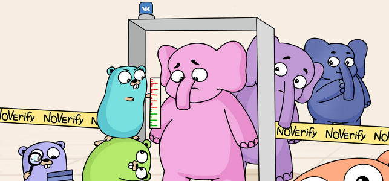

  

## NoVerify

NoVerify is a PHP linter: it finds possible bugs and style violations in your code.

- NoVerify has no config: any reported issue in your PHPDoc or PHP code must be fixed.
- NoVerify aims to understand PHP code at least as well as PHPStorm does. If it behaves incorrectly or sub optimally, please [report issue](https://github.com/VKCOM/noverify/issues/new).
- This tool is written in [Go](https://golang.org/) and uses fork of [z7zmey/php-parser](https://github.com/VKCOM/php-parser).

## Features

1. Fast: analyze ~100k LOC/s (lines of code per second) on Core i7;
2. Incremental: can analyze changes in git and show only new reports. Indexing speed is ~1M LOC/s;
3. Auto fixes for some warnings;
4. PHP 7 and PHP 8 support;
5. Diff and baseline modes support.

## Default lints

NoVerify by default has the following checks:

- Unreachable code
- Too few arguments when calling a function/method
- Call to undefined function/method
- Fetching of undefined constant/class property
- Class not found
- PHPDoc is incorrect
- Undefined variable
- Variable not always defined
- Case without `break;`
- Syntax error
- Unused variable
- Incorrect access to private/protected elements
- Incorrect implementation of `IteratorAggregate` interface
- Incorrect array definition, e.g. duplicate keys
- And others, you can see the entire list [here](/docs/checkers_doc.md)

## User Guide

- [How to install NoVerify](docs/install.md)

Using NoVerify as linter:
- [Using NoVerify as linter / static analyser](docs/getting_started.md)

Extending NoVerify:
- [Writing own rules quickly with PHP](docs/dynamic_rules.md)
- [Writing new checks in Go](docs/writing-checks-in-go.md)

Using NoVerify as PHP [language server](https://langserver.org) (version **0.3.0** and bellow):
- [Using NoVerify as language server for VSCode](docs/vscode-plugin.md)
- [Using NoVerify as language server for Sublime Text](docs/sublime-plugin.md)
- [Writing new IDE/editor plugin](docs/writing-new-ide-plugin.md)

## Contributing

Feel free to contribute to this project. See [CONTRIBUTING.md](https://github.com/VKCOM/noverify/blob/master/CONTRIBUTING.md) for more information.